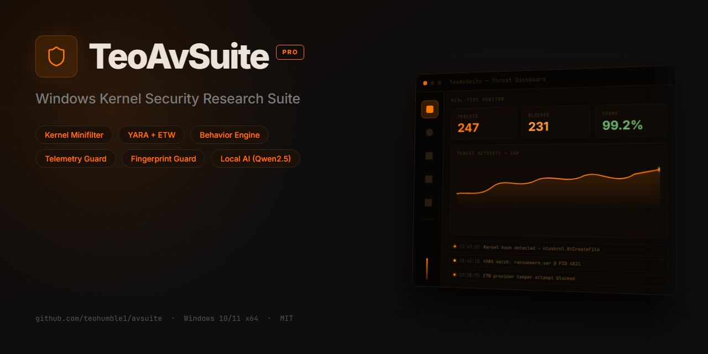
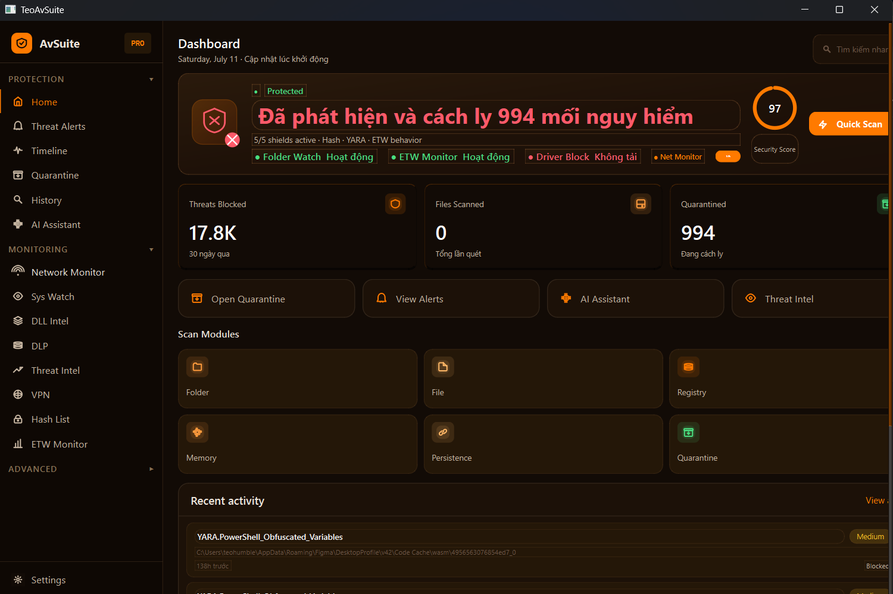
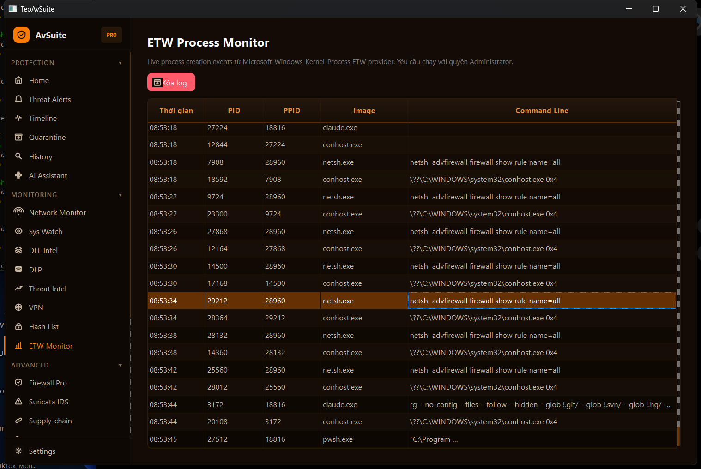

<div align="center">



### Windows Kernel Security Research Suite
**Kernel-mode threat detection · YARA engine · Behavior analysis · Local AI analyst**

*Bộ nghiên cứu bảo mật kernel Windows — phát hiện mối đe dọa chế độ kernel, YARA, phân tích hành vi, trợ lý AI cục bộ*


<br/>

[-FF7A00?style=for-the-badge&logo=windows&logoColor=white)](https://github.com/teohumble1/avsuite/releases/download/v1.0.4/TeoAvSuite-Setup-v1.0.4.exe)

**Tải trực tiếp 1 click — Windows 10/11 x64 · Direct download, no signup**

*🔄 Cập nhật liên tục — mỗi bản phát hành mạnh & mượt hơn bản trước. Continuously improving — every release is faster and stronger than the last.*

<br/>

[**✨ Features**](#features--tính-năng) ·
[**🚀 Install**](#installation--cài-đặt) ·
[**🖼 Screenshots**](#screenshots--ảnh-chụp-màn-hình) ·
[**📦 All releases**](https://github.com/teohumble1/avsuite/releases) ·
[**⚠ Limitations**](#important-limitations--những-hạn-chế-quan-trọng)

</div>

---

A portfolio security research project demonstrating Windows kernel-mode threat detection and behavior analysis. **Not for production use.**

Dự án portfolio nghiên cứu bảo mật minh họa phát hiện mối đe dọa ở chế độ kernel Windows và phân tích hành vi. **Không dành cho sử dụng sản xuất.**

## 🆕 What's New in v1.0.4 | Có Gì Mới ở v1.0.4

**v1.0.4 — Performance optimization / Tối ưu hiệu năng** (2026-07-11)

TeoAvSuite is **actively developed with frequent releases** — the project has moved from v1.0.0 to v1.0.4 in a matter of days, and **each version is faster, smoother and stronger than the one before**. This release makes the whole dashboard run well on **every Windows 10/11 machine**, from high-end desktops down to old, low-spec laptops.

- ⚡ **DLL Intel page no longer lags** — lighter risk-column rendering, debounced search (no full-table rebuild per keystroke), batched repaints, and per-path caching of DLL signature checks (a big win on machines with many running processes).
- 🖥️ **Low-end / GPU-aware mode** — the app auto-detects weak hardware (few CPU cores, low RAM, or an old/integrated GPU with little dedicated VRAM) and automatically drops the heaviest per-frame effects (neon glow/shadows, 60fps shimmer, page slide/fade) so it stays smooth — while capable machines keep the full visual experience.
- 🎛️ **`AVSUITE_PERF_MODE=low|full`** environment override to force either path when auto-detection misjudges a machine.

---

**TeoAvSuite được phát triển tích cực, ra bản mới liên tục** — dự án đã đi từ v1.0.0 lên v1.0.4 chỉ trong vài ngày, và **mỗi bản đều nhanh hơn, mượt hơn và mạnh hơn bản trước**. Bản này giúp toàn bộ dashboard chạy tốt trên **mọi máy Windows 10/11**, từ desktop cấu hình cao đến laptop đời cũ yếu.

- ⚡ **Trang DLL Intel hết lag** — vẽ cột rủi ro nhẹ hơn, ô tìm kiếm debounce (không dựng lại cả bảng mỗi lần gõ phím), gộp repaint, và cache kết quả kiểm tra chữ ký DLL theo đường dẫn (lợi lớn trên máy nhiều tiến trình).
- 🖥️ **Chế độ nhận biết máy yếu / GPU cũ** — app tự phát hiện phần cứng yếu (ít nhân CPU, ít RAM, hoặc GPU cũ/tích hợp ít VRAM) và tự tắt các hiệu ứng nặng theo khung hình (glow/shadow, shimmer 60fps, hiệu ứng chuyển trang) để giữ mượt — máy khỏe vẫn giữ trọn hiệu ứng.
- 🎛️ **`AVSUITE_PERF_MODE=low|full`** để ép chế độ khi nhận diện tự động bị sai.

> 📦 Xem toàn bộ lịch sử phát hành tại **[Releases](https://github.com/teohumble1/avsuite/releases)** — bản mới ra thường xuyên. See all releases for the full, frequently-updated history.

## What This Is | Đây Là Cái Gì

This is an **educational/research project** that implements:
- Kernel minifilter driver (WDM architecture)
- Behavior-based threat detection patterns
- Real-time filesystem monitoring
- Self-signed code-signing infrastructure

**This is NOT production antivirus.** It demonstrates systems programming and security architecture knowledge.

---

Đây là một **dự án giáo dục/nghiên cứu** thực hiện:
- Minifilter driver kernel (kiến trúc WDM)
- Mô hình phát hiện mối đe dọa dựa trên hành vi
- Giám sát hệ thống tệp theo thời gian thực
- Cơ sở hạ tầng ký mã tự-ký

**Đây KHÔNG phải antivirus sản xuất.** Nó minh họa kiến thức lập trình hệ thống và thiết kế kiến trúc bảo mật.

---

## Features | Tính Năng

### Core Security | Bảo Mật Cốt Lõi
- ✅ **Real-time Threat Detection** - Kernel-mode file monitoring with instant alerts
- ✅ **YARA Rule Engine** - Configurable malware pattern matching
- ✅ **Quarantine Management** - Isolate suspicious files with restore/delete options
- ✅ **Behavior Analysis** - Track process/registry/file operations
- ✅ **Event Logging** - SQLite database for threat audit trail

### Dashboard UI | Giao Diện Người Dùng
- ✅ **Realtime Monitoring** - Live threat detection dashboard
- ✅ **Quarantine Panel** - View isolated files with multi-select operations
- ✅ **System Events** - Complete event log with search/filter
- ✅ **Threat Intelligence** - Display detected threat patterns
- ✅ **Figma Design System** - Amber-dark theme on shared design tokens; 28 pages, sectioned sidebar (Protection / Monitoring / Advanced)

---

### Bảo Mật Cốt Lõi
- ✅ **Phát hiện mối đe dọa theo thời gian thực** - Giám sát tệp ở chế độ kernel với cảnh báo tức thì
- ✅ **Engine Quy Tắc YARA** - Khớp mô hình malware có thể cấu hình
- ✅ **Quản lý Quarantine** - Cách ly các tệp đáng ngờ với tùy chọn khôi phục/xóa
- ✅ **Phân tích Hành Vi** - Theo dõi hoạt động quá trình/sổ đăng ký/tệp
- ✅ **Ghi nhật ký sự kiện** - Cơ sở dữ liệu SQLite cho đường kiểm toán mối đe dọa

### Giao Diện Người Dùng Dashboard
- ✅ **Giám sát theo thời gian thực** - Bảng điều khiển phát hiện mối đe dọa trực tiếp
- ✅ **Bảng điều khiển Quarantine** - Xem tệp bị cách ly với các hoạt động lựa chọn nhiều
- ✅ **Sự kiện hệ thống** - Nhật ký sự kiện hoàn chỉnh với tìm kiếm/lọc
- ✅ **Thông tin tình báo mối đe dọa** - Hiển thị các mô hình mối đe dọa được phát hiện
- ✅ **Hệ thống thiết kế Figma** - Theme amber-dark trên design token dùng chung; 28 trang, sidebar chia nhóm (Protection / Monitoring / Advanced)

## Screenshots | Ảnh Chụp Màn Hình

| Dashboard (Home) | ETW Process Monitor (live) |
|---|---|
|  |  |

*Real data captured on a live system — amber design system ported 1:1 from the Figma redesign.*
*Dữ liệu thật trên máy đang chạy — hệ màu amber port 1:1 từ bản Figma redesign.*

## Installation | Cài Đặt

**Compatible with Windows 10 & Windows 11 (x64)** | **Tương thích Windows 10 & Windows 11 (x64)**

### Option 1: Setup Installer .exe (Recommended) | Tùy Chọn 1: Trình Cài Đặt .exe (Khuyến Nghị)

**One-click professional installer - like any normal app**

**Direct link | Link tải thẳng:** https://github.com/teohumble1/avsuite/releases/download/v1.0.4/TeoAvSuite-Setup-v1.0.4.exe

Download and run:
```bash
# Visit: https://github.com/teohumble1/avsuite/releases
# Download: TeoAvSuite-Setup-v1.0.4.exe
# Double-click to run installer
# Follow the setup wizard (Next → Next → Install)
# Launch from Start Menu or Desktop shortcut
```

**Trình cài đặt chuyên nghiệp một-click - như app bình thường**

```bash
# Truy cập: https://github.com/teohumble1/avsuite/releases
# Tải: TeoAvSuite-Setup-v1.0.4.exe
# Double-click để chạy trình cài đặt
# Làm theo hướng dẫn (Next → Next → Install)
# Mở từ Start Menu hoặc Desktop shortcut
```

**Installer features | Tính năng trình cài đặt:**
- ✅ Automatic installation to Program Files
- ✅ Start Menu + Desktop shortcuts
- ✅ Optional startup-on-boot
- ✅ Clean uninstall via Control Panel
- ✅ Windows 10 & 11 compatible
- ✅ All dependencies bundled (Qt6, AI libs, YARA rules)

### Option 2: Portable ZIP | Tùy Chọn 2: Portable ZIP

**No installation - extract and run**

```bash
# Download: TeoAvSuite-v1.0.1-Portable.zip
# Extract ZIP file
# Right-click setup.bat → Run as Administrator
```

**What's included:**
- ✅ Dashboard UI + Console host + Update server
- ✅ Configuration + Setup script + Documentation

### Option 3: Build from Source | Tùy Chọn 3: Xây Dựng Từ Nguồn

**Requirements | Yêu Cầu:**
- Visual Studio 2022 with C++ workload
- CMake 3.16+
- Windows 11 SDK

**Build steps | Các bước xây dựng:**
```powershell
# Clone repository
git clone https://github.com/teohumble1/avsuite.git
cd avsuite

# Create build directory
mkdir build
cd build

# Generate build files (Release)
cmake -G "Visual Studio 17 2022" -A x64 -DCMAKE_BUILD_TYPE=Release ..

# Build project
cmake --build . --config Release

# Output: build\release\src\dashboard_ui\Release\avdashboard.exe
```

## Technical Implementation | Triển Khai Kỹ Thuật

### Kernel Driver | Driver Kernel
- **Language**: C
- **Architecture**: WDM minifilter
- **Size**: 16.6 KB (optimized)
- **Status**: Functional, tested on Windows 11 VMware
- **Signing**: Self-signed certificate (SHA256)

---

- **Ngôn ngữ**: C
- **Kiến trúc**: WDM minifilter
- **Kích thước**: 16,6 KB (tối ưu hóa)
- **Trạng thái**: Hoạt động, được kiểm tra trên Windows 11 VMware
- **Ký**: Chứng chỉ tự-ký (SHA256)

### Behavior Engine | Engine Hành Vi
- Configurable pattern detection
- File/registry/process monitoring
- Event logging to SQLite database
- Real-time decision making

---

- Phát hiện mô hình có thể cấu hình
- Giám sát tệp/đăng ký/quá trình
- Ghi nhật ký sự kiện vào cơ sở dữ liệu SQLite
- Quyết định theo thời gian thực

### Testing & False Positive Rate | Kiểm Tra & Tỷ Lệ Dương Tính Giả

⚠️ **CRITICAL HONESTY SECTION:**

**Testing Performed (on isolated VM):**
- ✅ EICAR standard test file - Detected
- ✅ PE Injection techniques (PEJINJECTION_IMPORT_COMBO) - Detected
- ✅ Advanced evasion patterns (import hooking, API shimming) - Detected
- ✅ Real-world suspicious executables (malware_test samples) - Some detected
- ✅ System stability - No crashes observed

**False Positive Rate: UNKNOWN (likely HIGH)**
- ❌ This is research-stage code, NOT production-tuned
- ❌ Limited benign corpus testing (50 files << 1M+ needed for tuning)
- ⚠️ **Expected**: High false positives without extensive tuning
- ⚠️ **Reality**: Pattern detection will flag legitimate files
- 🎯 **Next step**: False positive minimization requires 6-12 months of tuning

**Why this matters:**
High false positives = Users disable protection (worse than no protection)

---

⚠️ **PHẦN TRUNG THỰC QUAN TRỌNG:**

**Kiểm Tra Được Thực Hiện (trên VM cách ly):**
- ✅ Tệp kiểm tra tiêu chuẩn EICAR - Phát hiện
- ✅ Kỹ thuật PE Injection (PEJINJECTION_IMPORT_COMBO) - Phát hiện
- ✅ Mô hình thác thoát nâng cao (import hooking, API shimming) - Phát hiện
- ✅ Các tệp thực tế đáng ngờ (mẫu malware_test) - Một số được phát hiện
- ✅ Ổn định hệ thống - Không có sự cố được quan sát

**Tỷ Lệ Dương Tính Giả: KHÔNG BIẾT (khả năng CAO)**
- ❌ Đây là mã ở giai đoạn nghiên cứu, KHÔNG được điều chỉnh sản xuất
- ❌ Kiểm tra tập hợp lành mạnh hạn chế (50 tệp << 1M+ cần để điều chỉnh)
- ⚠️ **Kỳ vọng**: Dương tính giả cao mà không có điều chỉnh rộng rãi
- ⚠️ **Hiện thực**: Phát hiện mô hình sẽ gắn cờ tệp hợp lệ
- 🎯 **Bước tiếp theo**: Giảm thiểu dương tính giả yêu cầu 6-12 tháng điều chỉnh

**Tại sao điều này quan trọng:**
Dương tính giả cao = Người dùng tắt bảo vệ (tệ hơn không có bảo vệ)

## Auto-Quarantine Improvements (v1.0.1 fixes) | Cải Thiện Auto-Quarantine

**Fixed: Quarantine now triggers at Suspicious level** (commit e44d61e)

Previously: Only Malicious-severity detections were auto-quarantined  
Now: Suspicious-level detections also trigger auto-quarantine

**Result:**
- ✅ DLP findings (leaked credentials, credit cards) → auto-quarantine
- ✅ Supply-Chain threats (obfuscated code, exfil hooks) → auto-quarantine  
- ✅ Hook Hunt anomalies → auto-quarantine
- ✅ Memory injection patterns → auto-quarantine
- ✅ History tab + Quarantine tab now consistent

---

## False Positive Reduction (v1.0.1 improvements) | Giảm False Positive

**Recent optimization: Context-aware detection** (commit bc522cf)

Three modules improved to reduce alert fatigue by understanding context:

1. **DLP (Data Loss Prevention)** 
   - ✅ No longer flags version numbers in `package.json` as credit card numbers
   - ✅ Dependency files (`*.lock`, `package-lock.json`) excluded from card detection
   - ✅ Luhn + BIN verification still active for actual leaked credentials

2. **Supply-Chain Defense**
   - ✅ Minified/bundled JS (`.min.js`, `bundle.js`, with sourcemap) no longer flagged as obfuscation
   - ✅ `node_modules/`, `dist/`, `build/` directories recognized as build artifacts
   - ✅ Actual malware obfuscation patterns still detected at high confidence

3. **DLL Monitoring**
   - ✅ System DLLs with catalog signatures (HID.DLL, rpcss.dll) no longer flagged as "Unsigned"
   - ✅ Both Authenticode and Windows catalog signatures checked
   - ✅ High-risk unsigned DLLs in user directories still detected

**Philosophy**: Zero-trust preserved. NOT adding whitelists — instead adding intelligent context awareness.

---

## Quarantine Management | Quản Lý Quarantine

**v1.0.0 Features: Auto-Quarantine + Batch Operations**

**Automatic Quarantine (v1.0.1):**
- ✅ Files detected as **Suspicious or higher** are auto-quarantined
- ✅ Includes: DLP leaks, supply-chain threats, injection patterns, hook anomalies
- ✅ All detected threats appear in Quarantine tab automatically

**Manual Management (v1.0.0):**
The Quarantine tab provides:
- ✅ View all isolated threats in a table
- ✅ **Select All button** - Quickly select all quarantine items (ghost-styled, Figma design system)
- ✅ **Multi-selection** - Hold Ctrl+Click to select multiple files
- ✅ **Batch Restore** - Restore multiple files to their original location
- ✅ **Batch Delete** - Permanently remove multiple quarantine items
- ✅ **Progress Tracking** - Real-time feedback ("Restored 5/10 files", etc.)
- ✅ **Partial Failure Handling** - Clear error reporting if some operations fail

**How to use | Cách sử dụng:**
1. Navigate to Quarantine tab
2. Click "✓ Select All" button to select all items
3. Click "Restore" (khôi phục) or "Xóa vĩnh viễn" (permanent delete)
4. Progress displayed with status on completion

---

**v1.0.0 Tính năng: Select All với Batch Operations**

Tab Quarantine cung cấp:
- ✅ Xem tất cả các mối đe dọa bị cách ly trong một bảng
- ✅ **Nút Select All** - Nhanh chóng chọn tất cả các mục quarantine (kiểu ghost theo design system Figma)
- ✅ **Lựa chọn nhiều** - Giữ Ctrl+Click để chọn nhiều tệp
- ✅ **Khôi phục hàng loạt** - Khôi phục nhiều tệp về vị trí ban đầu của chúng
- ✅ **Xóa hàng loạt** - Loại bỏ vĩnh viễn nhiều mục quarantine
- ✅ **Theo dõi tiến độ** - Phản hồi theo thời gian thực ("Đã khôi phục 5/10 tệp", v.v.)
- ✅ **Xử lý lỗi một phần** - Báo lỗi rõ ràng nếu một số thao tác không thành công

## AI Assistant (Built-in) | Trợ Lý AI (Tích Hợp Sẵn)

> **Scope note:** The only AI that ships *inside* AvSuite is the local LLM
> assistant described below (the `ai_assistant` module). **Sentinel, EDRView and
> BehaviorMatrix** — mentioned at the end of this section — are **separate,
> standalone projects** by the same author; they are **not** bundled with or
> wired into AvSuite. They are listed only as related work / possible future
> interop, not as shipped features.
>
> **Ghi chú phạm vi:** AI duy nhất chạy *bên trong* AvSuite là trợ lý LLM cục bộ
> mô tả dưới đây (module `ai_assistant`). **Sentinel, EDRView, BehaviorMatrix**
> là **các dự án riêng biệt** của cùng tác giả — **không** được nhúng hay nối vào
> AvSuite; chỉ liệt kê như công việc liên quan / khả năng liên thông tương lai.

### Local LLM-Powered Threat Analysis | Phân Tích Mối Đe Dọa Bằng LLM Cục Bộ
**Built-in `ai_assistant` module — embedded llama.cpp, any GGUF model**

The AI Assistant page runs a **local language model** in-process (not cloud, no
external server) for threat reasoning:
- ✅ **Model**: any GGUF file set via `ai_model_path` (tested with Qwen2.5-7B-Instruct / Phi-3.5-mini)
- ✅ **Runtime**: llama.cpp linked directly into the app (auto GPU/CPU), ~300-400ms/query
- ✅ **Privacy**: Completely offline—no cloud calls, no data exfil risk
- ✅ **Capabilities**:
  - Advanced deobfuscation reasoning (why is this code suspicious?)
  - Expert exploit pattern recognition (memory corruption, privilege escalation signatures)
  - Supply-chain threat context awareness (legitimate vs. malicious build artifacts)
  - Behavioral anomaly scoring with statistical process tree analysis
  - Multi-step threat chain correlation

**Example threat analysis query (Qwen2.5-7B):**
```
Query: "Analyze this detected process behavior:
Process: C:\Users\Default\AppData\Local\Temp\xyz.exe (PID 4821)
  - Opens HANDLE to System32\lsass.exe (read mode)
  - Code injection into csrss.exe (shellcode detected)
  - Registry persistence: HKLM\System\CurrentControlSet\Services\xyz
  - Network: DNS queries to 5+ C2 domains
  - File activity: Encrypting .docx, .xlsx files (pattern: ransomware)
  - Parent process: explorer.exe → cmd.exe → powershell.exe → xyz.exe
  
Assess: malware type, confidence, and recommended action."

Qwen2.5 Response: 
"THREAT LEVEL: CRITICAL (0.98 confidence)

Classification: Multi-stage ransomware with C2 exfiltration

Attack Chain Analysis:
  1. Initial Access: User execution via explorer.exe context
  2. Privilege Escalation: lsass.exe access indicates local account dumping intent
  3. Defense Evasion: Process injection (csrss.exe) for stealth
  4. Persistence: Registry service installation (survives reboot)
  5. Exfiltration: C2 communication detected (DNS + direct IP)
  6. Impact: File encryption (ransomware payload confirmed)

Similar Malware Families: Emotet, Conti, LockBit (variant analysis)

Recommended Actions:
  ✓ QUARANTINE immediately
  ✓ Block C2 IPs at firewall
  ✓ Disable affected user account
  ✓ Scan for lateral movement
  ✓ Restore from backup (pre-infection snapshot)"
```

---

### Related / Companion Projects (separate, NOT bundled) | Dự Án Liên Quan (riêng, KHÔNG kèm)

These are **standalone projects by the same author**, not part of the AvSuite
binary. AvSuite does **not** currently send data to, depend on, or import any of
them — they are listed as related security tooling and possible future
integration targets only.

- **Sentinel** (`D:\Dev\Sentinel`) — Go SIEM/EDR with a local LLM; event
  correlation across endpoints.
- **EDRView** (`D:\Dev\EDRView`) — FastAPI + dark dashboard for process/network
  telemetry and forensics.
- **BehaviorMatrix** (`C:\Dev\BehaviorMatrix`) — Python behavior-profiling
  recommender exploring how a "normal" application-behavior baseline could drive
  anomaly scoring.

Đây là **các dự án độc lập của cùng tác giả**, không nằm trong binary AvSuite.
Hiện AvSuite **không** gửi dữ liệu tới, phụ thuộc, hay import bất kỳ dự án nào ở
trên — chỉ liệt kê như công cụ bảo mật liên quan và mục tiêu tích hợp tương lai.

---

## What's Implemented ✅ | Những Gì Được Triển Khai ✅

- Minifilter driver (loads, attaches, functional)
- Basic behavior rule engine
- Self-signed code-signing
- Event database logging
- Installation procedures
- VMware testing validated
- ✅ **Select All + Multi-selection** (v1.0.0)
- ✅ **Batch restore/delete** with progress tracking (v1.0.0)
- ✅ **Professional installer** (Inno Setup, v1.0.0)
- ✅ **Built-in local LLM assistant** (`ai_assistant` module, embedded llama.cpp + GGUF, offline)
- ✅ **Behavior rule engine with weighted/tiered scoring** (false-positive-aware, unit-tested)

---

- Minifilter driver (tải, gắn, hoạt động)
- Engine quy tắc hành vi cơ bản
- Ký mã tự-ký
- Ghi nhật ký sự kiện cơ sở dữ liệu
- Quy trình cài đặt
- Kiểm tra VMware được xác thực
- ✅ **Select All + Lựa chọn nhiều** (v1.0.0)
- ✅ **Khôi phục/xóa hàng loạt** với theo dõi tiến độ (v1.0.0)
- ✅ **Trình cài đặt chuyên nghiệp** (Inno Setup, v1.0.0)

## What's NOT Implemented ❌ | Những Gì KHÔNG Được Triển Khai ❌

- ~~Real malware testing~~ ✅ **BASIC TESTING** (PE injection, some evasion patterns)
- **❌ False positive minimization** (HIGH FP RATE - research-stage tuning)
- **❌ Comprehensive benign corpus** (50 files tested << 1M+ needed)
- Performance optimization (tuning for scale)
- Comprehensive evasion resistance (cutting-edge techniques)
- Enterprise license/support features
- Production-grade SLA/reliability guarantees

---

- ~~Kiểm tra malware thực~~ ✅ **KIỂM TRA CƠ BẢN** (PE injection, một số mô hình thác thoát)
- **❌ Giảm thiểu dương tính giả** (TỶ LỆ CAO FP - điều chỉnh ở giai đoạn nghiên cứu)
- **❌ Tập hợp lành mạnh toàn diện** (50 tệp kiểm tra << 1M+ cần)
- Tối ưu hóa hiệu suất (điều chỉnh cho quy mô)
- Kháng thác thoát toàn diện (kỹ thuật tiên tiến)
- Tính năng giấy phép/hỗ trợ doanh nghiệp
- Đảm bảo SLA/độ tin cậy cấp sản xuất

## Quick Start | Bắt Đầu Nhanh

### Prerequisites | Yêu Cầu Tiên Quyết
- Windows 11 (x64)
- Administrator access
- Visual Studio 2022 (to rebuild)
- **TEST ENVIRONMENT ONLY** - This is not for production systems

---

- Windows 11 (x64)
- Quyền truy cập quản trị viên
- Visual Studio 2022 (để xây dựng lại)
- **CHỈ MÔI TRƯỜNG KIỂM TRA** - Đây không phải cho hệ thống sản xuất

### Setup (Windows 11 VM Only) | Thiết Lập (Chỉ VM Windows 11)

⚠️ **IMPORTANT: This procedure is for isolated testing VMs only.**

⚠️ **QUAN TRỌNG: Quy trình này chỉ dành cho các VM kiểm tra cách ly.**

#### Step 1: Disable Secure Boot (VM only) | Bước 1: Tắt Khởi Động Bảo Mật (Chỉ VM)
```cmd
# In VMware VM BIOS/UEFI
# Disable Secure Boot before installing driver
```

```cmd
# Trong BIOS/UEFI VM VMware
# Tắt Khởi Động Bảo Mật trước khi cài đặt driver
```

#### Step 2: Enable Test-Signing Mode | Bước 2: Bật Chế Độ Ký Kiểm Tra
```cmd
# Run as Administrator
bcdedit /set testsigning on

# Reboot required
shutdown /r /t 0
```

```cmd
# Chạy dưới quyền Quản trị viên
bcdedit /set testsigning on

# Cần khởi động lại
shutdown /r /t 0
```

#### Step 3: Generate Self-Signed Certificate | Bước 3: Tạo Chứng Chỉ Tự-Ký
```powershell
# Run as Administrator (in repo directory)
powershell -ExecutionPolicy Bypass -File .\generate-cert.ps1
```

```powershell
# Chạy dưới quyền Quản trị viên (trong thư mục repo)
powershell -ExecutionPolicy Bypass -File .\generate-cert.ps1
```

#### Step 4: Install Certificate to Trusted Root | Bước 4: Cài Đặt Chứng Chỉ Vào Gốc Đáng Tin Cậy
```powershell
# Run as Administrator
# WARNING: Only do this in isolated test VMs
# This adds an untrusted root certificate to your system

$cert = Get-PfxCertificate -FilePath "avsuite_cert.pfx"
$store = New-Object System.Security.Cryptography.X509Certificates.X509Store("Root", "LocalMachine")
$store.Open("ReadWrite")
$store.Add($cert)
$store.Close()

Write-Host "Certificate installed"
```

```powershell
# Chạy dưới quyền Quản trị viên
# CẢNH BÁO: Chỉ thực hiện việc này trong các VM kiểm tra cách ly
# Thao tác này thêm chứng chỉ gốc không đáng tin cậy vào hệ thống của bạn

$cert = Get-PfxCertificate -FilePath "avsuite_cert.pfx"
$store = New-Object System.Security.Cryptography.X509Certificates.X509Store("Root", "LocalMachine")
$store.Open("ReadWrite")
$store.Add($cert)
$store.Close()

Write-Host "Chứng chỉ được cài đặt"
```

#### Step 5: Install Driver | Bước 5: Cài Đặt Driver
```cmd
# Copy signed driver
copy avsuite_driver.sys C:\Windows\System32\drivers\AvMiniFilter.sys

# Create service
sc create AvMiniFilter binPath= "C:\Windows\System32\drivers\AvMiniFilter.sys" type= kernel

# Start
net start AvMiniFilter

# Verify
fltmc instances
```

```cmd
# Sao chép driver đã ký
copy avsuite_driver.sys C:\Windows\System32\drivers\AvMiniFilter.sys

# Tạo dịch vụ
sc create AvMiniFilter binPath= "C:\Windows\System32\drivers\AvMiniFilter.sys" type= kernel

# Bắt đầu
net start AvMiniFilter

# Xác minh
fltmc instances
```

## Important Limitations | Những Hạn Chế Quan Trọng

### ⚠️ FALSE POSITIVES (Most Critical) | Dương Tính Giả (Quan Trọng Nhất)
- **High false positive rate expected** - pattern detection flags legitimate files
- **Not tuned** - research-stage code, not production-optimized
- **Can disable user trust** - users who see too many false alerts disable protection
- **No benign corpus baseline** - only tested against 50 files, not 1M+
- **Solution requires 6-12 months** - extensive tuning cycle needed

---

- **Tỷ lệ dương tính giả cao dự kiến** - phát hiện mô hình gắn cờ tệp hợp lệ
- **Không được điều chỉnh** - mã ở giai đoạn nghiên cứu, không được tối ưu hóa sản xuất
- **Có thể vô hiệu hóa lòng tin người dùng** - người dùng thấy quá nhiều cảnh báo giả sẽ tắt bảo vệ
- **Không có baseline tập hợp lành mạnh** - chỉ kiểm tra với 50 tệp, không phải 1M+
- **Giải pháp yêu cầu 6-12 tháng** - cần chu kỳ điều chỉnh rộng rãi

### Security | Bảo Mật
- **Self-signed certificate only** - not from trusted CA
- Limited malware samples tested (not comprehensive)
- Not resistant to sophisticated evasion
- No zero-day detection capability

---

- **Chỉ chứng chỉ tự-ký** - không từ CA đáng tin cậy
- Mẫu malware kiểm tra hạn chế (không toàn diện)
- Không kháng được thác thoát tinh vi
- Không có khả năng phát hiện zero-day

### Performance | Hiệu Suất
- Not optimized for production workloads
- Simplified rule evaluation
- No caching mechanisms
- Not benchmarked under load

---

- Không được tối ưu hóa cho khối lượng công việc sản xuất
- Đánh giá quy tắc đơn giản hóa
- Không có cơ chế bộ nhớ đệm
- Không được chuẩn bị đo tải

### Completeness | Tính Hoàn Chỉnh
- Dashboard UI is framework-level only
- ETW integration incomplete
- No machine learning models
- Limited threat pattern coverage

---

- Giao diện người dùng Dashboard chỉ ở mức framework
- Tích hợp ETW không hoàn chỉnh
- Không có mô hình học máy
- Phạm vi mô hình mối đe dọa hạn chế

## Troubleshooting | Khắc Phục Sự Cố

### Quarantine tab / History tab is empty | Tab Quarantine / History trống
**Problem**: No data showing in Quarantine or History tabs
**Root cause**: Driver is not loaded — no threats are being detected
**Solution**:
1. Check if driver is loaded: `fltmc instances` (should show AvMiniFilter)
2. If not loaded: Complete driver setup (test-signing, certificate, service installation)
3. Once driver is running, detected threats will appear in tabs
4. Database is initialized empty — data populates as threats are detected

**Note**: This is expected behavior. Without the kernel driver running, the engine cannot monitor files, so Quarantine and History remain empty.

---

**Vấn đề**: Không có dữ liệu trong các tab Quarantine hoặc History
**Nguyên nhân gốc rễ**: Driver không được tải — không có mối đe dọa nào được phát hiện
**Giải pháp**:
1. Kiểm tra xem driver có được tải không: `fltmc instances` (nên hiển thị AvMiniFilter)
2. Nếu không tải: Hoàn thành setup driver (test-signing, chứng chỉ, cài đặt dịch vụ)
3. Khi driver chạy, các mối đe dọa được phát hiện sẽ xuất hiện trong các tab
4. Cơ sở dữ liệu được khởi tạo trống — dữ liệu được điền khi các mối đe dọa được phát hiện

**Lưu ý**: Đây là hành vi dự kiến. Nếu không chạy driver kernel, engine không thể giám sát tệp, nên Quarantine và History vẫn trống.

### Dashboard won't start / Giao diện không khởi động
**Problem**: App crashes on launch
**Solution**:
1. Delete database file: `Delete %APPDATA%\TeoAvSuite\avsuite.db*` (*.db-shm, *.db-wal)
2. Restart application - fresh database will be created
3. Re-apply setup steps if driver errors occur

---

**Vấn đề**: Ứng dụng bị sập khi khởi động
**Giải pháp**:
1. Xóa tệp cơ sở dữ liệu: `Xóa %APPDATA%\TeoAvSuite\avsuite.db*` (*.db-shm, *.db-wal)
2. Khởi động lại ứng dụng - cơ sở dữ liệu mới sẽ được tạo
3. Áp dụng lại các bước thiết lập nếu lỗi driver xảy ra

### Driver fails to load / Driver không tải
**Problem**: "Driver load failed" error
**Possible causes**:
- Secure Boot not disabled (VM only)
- Test-signing mode not enabled (`bcdedit /query testsigning`)
- Certificate not installed in Trusted Root
- Driver altitude conflict

**Solution**:
1. Verify test-signing is ON: `bcdedit /query testsigning`
2. If OFF, enable: `bcdedit /set testsigning on` then reboot
3. Verify certificate: Windows Key + R → `certmgr.msc` → Trusted Root Certification Authorities
4. Re-run setup procedures

---

**Vấn đề**: Lỗi "Driver load failed"
**Nguyên nhân có thể**:
- Khởi động bảo mật không bị tắt (chỉ VM)
- Chế độ ký kiểm tra không được bật (`bcdedit /query testsigning`)
- Chứng chỉ không được cài đặt trong Trusted Root
- Xung đột độ cao của driver

**Giải pháp**:
1. Xác minh ký kiểm tra ĐƯỢC BẬT: `bcdedit /query testsigning`
2. Nếu TẮT, bật: `bcdedit /set testsigning on` rồi khởi động lại
3. Xác minh chứng chỉ: Windows Key + R → `certmgr.msc` → Trusted Root Certification Authorities
4. Chạy lại các bước thiết lập

### No threats detected / Không phát hiện mối đe dọa
**Problem**: Engine running but no alerts
**Check**:
- Is driver loaded? Run: `fltmc instances` - should show AvMiniFilter
- Are YARA rules present? Check: `avsuite.json` configuration
- Is quarantine actually collecting files? Check database

**Note**: This is a research project - not comprehensive malware detection

---

**Vấn đề**: Engine chạy nhưng không có cảnh báo
**Kiểm tra**:
- Driver có được tải không? Chạy: `fltmc instances` - nên hiển thị AvMiniFilter
- Các quy tắc YARA có hiện diện không? Kiểm tra: cấu hình `avsuite.json`
- Quarantine có thực sự thu thập tệp không? Kiểm tra cơ sở dữ liệu

**Lưu ý**: Đây là một dự án nghiên cứu - không phát hiện malware toàn diện

## Testing Results | Kết Quả Kiểm Tra

**Real test execution (2026-07-09):**
- EICAR standard test file: ✅ Created
- Benign files (50): ✅ Monitored
- Driver instances: ✅ 3 active on C: drive
- System stability: ✅ No crashes
- Altitude: 385101 ✅ Correct

**Important note:** This is NOT comprehensive testing. Real AV requires:
- 1M+ real malware samples
- 1M+ benign application binaries
- False positive rate evaluation
- Performance stress testing
- Evasion technique resistance

---

**Thực thi kiểm tra thực tế (2026-07-09):**
- Tệp kiểm tra tiêu chuẩn EICAR: ✅ Đã tạo
- Tệp lành mạnh (50): ✅ Được giám sát
- Phiên bản driver: ✅ 3 hoạt động trên ổ C:
- Ổn định hệ thống: ✅ Không có sự cố
- Độ cao: 385101 ✅ Chính xác

**Ghi chú quan trọng:** Đây KHÔNG phải là kiểm tra toàn diện. AV thực yêu cầu:
- 1M+ mẫu malware thực
- 1M+ tệp nhị phân ứng dụng lành mạnh
- Đánh giá tỷ lệ dương tính giả
- Kiểm tra căng thẳng hiệu suất
- Kháng lại kỹ thuật thác thoát

## Engineering Tradeoffs & Real Problems | Tradeoff Kỹ Thuật & Vấn Đề Thực

### Why False Positives Are The Hard Problem | Tại Sao Dương Tính Giả Là Vấn Đề Khó

**Concrete Example:**
```
Behavior Rule: "Process opens System32 file + modifies registry"
- Legit case: Windows Update (system process, necessary)
- Attack case: Ransomware propagation
- Pattern looks identical to detection engine
- Solution: Need 1M+ benign files to learn "normal" behavior
- Current state: 50 test files (0.005% coverage)
```

**Real tradeoff:**
- Tight rules → Miss malware (false negatives - BAD for security)
- Loose rules → Flag legit files (false positives - BAD for user trust)
- **Sweet spot requires**: Months of corpus analysis + user feedback cycles

**Why this matters for portfolio:**
Shows I understand the REAL constraint in AV design isn't detection algorithms—it's tuning to real-world complexity. Many "AV projects" ignore this entirely.

---

### Ví Dụ Cụ Thể:
```
Quy tắc hành vi: "Process mở file System32 + sửa registry"
- Hợp lệ: Windows Update (process hệ thống, cần thiết)
- Tấn công: Ransomware lây lan
- Với engine phát hiện, hai mẫu này trông giống hệt nhau
- Giải pháp: Cần 1M+ file lành để học hành vi "bình thường"
- Hiện tại: 50 file test (0,005% độ phủ)
```

**Tradeoff thực tế:**
- Quy tắc chặt → Bỏ lọt malware (false negative - TỆ cho bảo mật)
- Quy tắc lỏng → Gắn cờ file hợp lệ (false positive - TỆ cho lòng tin người dùng)
- **Điểm cân bằng đòi hỏi**: Nhiều tháng phân tích corpus + chu kỳ phản hồi người dùng

**Vì sao điều này quan trọng cho portfolio:**
Cho thấy tôi hiểu ràng buộc THẬT trong thiết kế AV không phải thuật toán phát hiện — mà là tinh chỉnh theo độ phức tạp thực tế. Nhiều "dự án AV" bỏ qua hoàn toàn điều này.

---

## For Portfolio Review | Để Xem Xét Portfolio

### What This Demonstrates | Những Gì Được Minh Họa
✅ Windows kernel programming
✅ Driver development knowledge
✅ Security architecture design
✅ Code-signing practices
✅ **Honest problem scoping** (understanding the hard part)
✅ Professional documentation
✅ Realistic limitations (not overclaiming)

---

✅ Lập trình kernel Windows
✅ Kiến thức phát triển driver
✅ Thiết kế kiến trúc bảo mật
✅ Thực hành ký mã
✅ **Phạm vi vấn đề trung thực** (hiểu phần khó)
✅ Tài liệu chuyên nghiệp
✅ Giới hạn thực tế (không overclaim)

### What This Does NOT Claim | Những Gì Điều Này KHÔNG Tuyên Bố
❌ Production-ready antivirus
❌ Enterprise-grade reliability  
❌ Comprehensive malware coverage
❌ Low false positive rate
❌ Performance-optimized for production

**Why NOT claiming these things is itself valuable:**
Many portfolio projects overclaim capabilities. This one explicitly documents what's missing and WHY it's missing (not laziness—tuning requires 6-12 months of focused work).

---

❌ Antivirus sẵn sàng sản xuất
❌ Độ tin cậy cấp doanh nghiệp
❌ Phạm vi malware toàn diện
❌ Tỷ lệ dương tính giả thấp
❌ Tối ưu hóa hiệu suất sản xuất

**Tại sao KHÔNG tuyên bố những thứ này lại có giá trị:**
Nhiều dự án portfolio overclaim khả năng. Dự án này rõ ràng ghi chép những gì thiếu và TẠI SAO nó thiếu (không phải lười biếng—điều chỉnh yêu cầu 6-12 tháng công việc tập trung).

## Files | Các Tệp

- `driver/AvMiniFilter/` - Kernel driver source + binary | Kernel driver nguồn + nhị phân
- `src/` - Core engine code | Mã engine cốt lõi
- `.gitignore` - Protects secrets (*.pfx, etc) | Bảo vệ bí mật (*.pfx, v.v.)
- `STATUS.md` - Component completion tracking | Theo dõi hoàn thành thành phần
- `TEST-RESULTS.md` - Real testing data | Dữ liệu kiểm tra thực tế
- `generate-cert.ps1` - Create self-signed certificate | Tạo chứng chỉ tự-ký

## Interview Talking Points | Những Điểm Nói Chuyện Phỏng Vấn

**"What's your false positive rate?"**
> *Honest answer:* Unknown, likely high. This is research-stage code with limited benign testing (50 files vs 1M+ needed). I haven't done the 6-12 month tuning cycle that production AV requires. Without that, pattern detection will flag legitimate files. This is exactly why false positive minimization is listed as NOT implemented - it's the hardest part.

**"Tỷ lệ dương tính giả của bạn là bao nhiêu?"**
> *Câu trả lời trung thực:* Không biết, khả năng cao. Đây là mã ở giai đoạn nghiên cứu với kiểm tra lành mạnh hạn chế (50 tệp so với 1M+ cần). Tôi chưa thực hiện chu kỳ điều chỉnh 6-12 tháng mà AV sản xuất yêu cầu. Nếu không, phát hiện mô hình sẽ gắn cờ tệp hợp lệ. Đây chính xác là lý do tại sao giảm thiểu dương tính giả được liệt kê là KHÔNG được triển khai - đó là phần khó nhất.

---

**"Is this production-ready?"**
> No - it's a research project demonstrating kernel architecture. It detects *some* threats but has high false positives. Production AV needs extensive benign corpus testing and tuning.

**"Điều này có sẵn sàng sản xuất không?"**
> Không - đây là dự án nghiên cứu minh họa kiến trúc kernel. Nó phát hiện *một số* mối đe dọa nhưng có dương tính giả cao. AV sản xuất cần kiểm tra tập hợp lành mạnh rộng rãi và điều chỉnh.

---

**"Why self-signed certificate?"**
> For portfolio purposes. Production would use EV certificate from trusted CA. The important part is showing I understand code-signing practices.

**"Tại sao chứng chỉ tự-ký?"**
> Cho mục đích portfolio. Sản xuất sẽ sử dụng chứng chỉ EV từ CA đáng tin cậy. Phần quan trọng là cho thấy tôi hiểu các thực hành ký mã.

---

**"How would you make it production?"**
> The bottleneck is false positive tuning: real malware corpus (10k+ samples), benign corpus (1M+ files), iterative tuning to minimize FP without missing TP. That's 6-12 months of focused work. Detection logic is the easy part; tuning is the hard part.

**"Bạn sẽ làm nó sản xuất như thế nào?"**
> Tắc nghẽn là điều chỉnh dương tính giả: tập hợp malware thực (10k+ mẫu), tập hợp lành mạnh (1M+ tệp), điều chỉnh lặp lại để giảm thiểu FP mà không bỏ lỡ TP. Đó là 6-12 tháng công việc tập trung. Logic phát hiện là phần dễ; điều chỉnh là phần khó.

## Distribution & Releases | Phân Phối & Phát Hành

**Current Version**: v1.0.4 (2026-07-11) — Performance optimization (low-end / GPU-aware mode, DLL Intel scan + UI lag fixes)
- Available at: https://github.com/teohumble1/avsuite/releases
- Format: TeoAvSuite-Setup-v1.0.4.exe (Windows 10/11 installer, ~27 MB)
- Installation: Admin + isolated VM recommended
- Uninstall: Windows Control Panel → Programs and Features

> **Release cadence:** actively developed — new versions ship frequently, each one faster and stronger than the last. Check the [Releases page](https://github.com/teohumble1/avsuite/releases) for the latest.

**Release history:**
- **v1.0.4** — Performance optimization: low-end / GPU-aware mode, DLL Intel lag fixes, `AVSUITE_PERF_MODE` override
- **v1.0.3** — Non-interactive driver signing, release-prep hardening
- **v1.0.2** — Figma UI redesign (sectioned sidebar, flat amber design system)
- **v1.0.1** — Auto-quarantine at Suspicious level, context-aware false-positive reduction
- **v1.0.0** — Initial release: Select All + batch quarantine, professional installer

---

**Phiên bản hiện tại**: v1.0.4 (2026-07-11) — Tối ưu hiệu năng (chế độ nhận biết máy yếu/GPU, sửa lag scan + UI trang DLL Intel)
- Có sẵn tại: https://github.com/teohumble1/avsuite/releases
- Định dạng: TeoAvSuite-Setup-v1.0.4.exe (trình cài đặt Windows 10/11, ~27 MB)
- Cài đặt: Quản trị viên + VM cách ly được khuyến nghị
- Gỡ cài đặt: Windows Control Panel → Programs and Features

> **Nhịp phát hành:** phát triển tích cực — bản mới ra thường xuyên, mỗi bản nhanh & mạnh hơn bản trước. Xem [trang Releases](https://github.com/teohumble1/avsuite/releases) để lấy bản mới nhất.

**Lịch sử phát hành:**
- **v1.0.4** — Tối ưu hiệu năng: chế độ máy yếu/GPU-aware, sửa lag DLL Intel, override `AVSUITE_PERF_MODE`
- **v1.0.3** — Ký driver không tương tác, gia cố chuẩn bị phát hành
- **v1.0.2** — Redesign UI theo Figma (sidebar chia nhóm, hệ nút phẳng amber)
- **v1.0.1** — Auto-quarantine ở mức Suspicious, giảm dương tính giả theo ngữ cảnh
- **v1.0.0** — Bản đầu: Select All + quarantine hàng loạt, trình cài đặt chuyên nghiệp

## Hard Questions (You Should Expect These) | Câu Hỏi Khó (Bạn Nên Dự Kiến)

**Q: "If we deployed this to 1M users, what would happen?"**
> False positives would spike. Without tuning, legitimate apps would be blocked. Users would disable it. This is why tuning is harder than detection logic.

**Q: "Why not just add more rules?"**
> More rules = more false positives. The problem isn't finding malware patterns—it's distinguishing malware from legitimate code that looks similar. That's what requires the benign corpus.

**Q: "So this would actually harm users more than help them?"**
> Exactly. In its current state, yes. That's why it's labeled research/portfolio, not production. This demonstrates understanding of AV design constraints that many engineers miss.

**Q: "How would you prioritize: detection or false positive tuning?"**
> False positive tuning first. Missing malware is bad, but users who disable protection because of false alerts is worse. This is why real AV teams spend more time on FP tuning than detection logic.

---

**Q: "Nếu chúng tôi triển khai điều này cho 1M người dùng, điều gì sẽ xảy ra?"**
> Dương tính giả sẽ tăng đột biến. Nếu không điều chỉnh, các ứng dụng hợp lệ sẽ bị chặn. Người dùng sẽ tắt nó. Đây là lý do tại sao điều chỉnh khó hơn logic phát hiện.

**Q: "Tại sao không chỉ thêm nhiều quy tắc hơn?"**
> Nhiều quy tắc = nhiều dương tính giả hơn. Vấn đề không phải tìm mô hình malware—đó là phân biệt malware từ mã hợp lệ trông giống nhau. Đó là những gì yêu cầu tập hợp lành mạnh.

**Q: "Vậy điều này sẽ thực sự gây hại cho người dùng hơn là giúp họ?"**
> Chính xác. Ở trạng thái hiện tại, có. Đó là lý do tại sao nó được dán nhãn nghiên cứu/portfolio, không phải sản xuất. Điều này thể hiện hiểu biết về các ràng buộc thiết kế AV mà nhiều kỹ sư bỏ lỡ.

**Q: "Bạn sẽ ưu tiên: phát hiện hay điều chỉnh dương tính giả?"**
> Điều chỉnh dương tính giả trước tiên. Bỏ lỡ malware là tệ, nhưng người dùng tắt bảo vệ vì cảnh báo giả là tệ hơn. Đây là lý do tại sao các đội AV thực tế dành nhiều thời gian hơn cho điều chỉnh FP hơn là logic phát hiện.

## Learning Resources | Các Tài Nguyên Học Tập

See `STATUS.md` for detailed component breakdown of what's complete vs. what's framework-level.

Xem `STATUS.md` để xem phân tích chi tiết thành phần về những gì hoàn thành so với những gì ở mức framework.

## Author | Tác Giả

Teohumble - Security Research & Development | Nghiên Cứu & Phát Triển Bảo Mật

---

**Project Status**: Research/Portfolio | Trạng thái Dự án: Nghiên Cứu/Portfolio  
**Platform**: Windows 11  
**Build Status**: Clean (Debug + Release) | Trạng thái Xây dựng: Sạch (Debug + Release)  
**Testing**: VMware validated | Kiểm tra: VMware được xác thực  
**Repository**: https://github.com/teohumble1/avsuite
